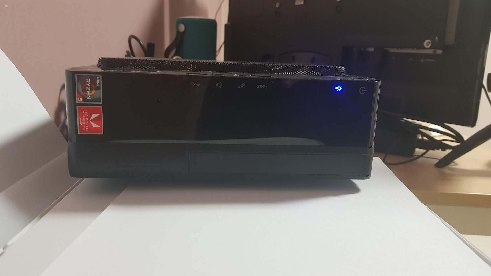
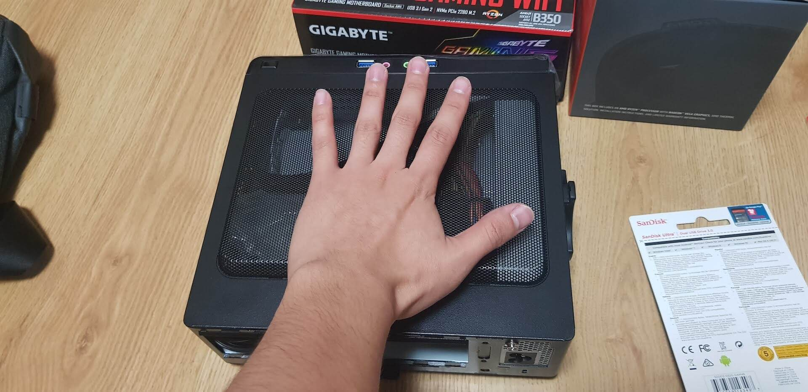

첫 블로깅 소재를 제 홈서버로 사용하고 있는 ITX 미니 컴퓨터로 잡았습니다. 요녀석이 현재 제 개발용 홈서버의 역할도 톡톡히 하고 있는지라 항상 고마운(?) 마음이 있거든요.  



(구석에서 묵묵히 일해주고 있는 녀석)

---

## ITX 미니 컴퓨터

```
조립에 사용된 부품

CPU  : 라이젠 2400g 
M/B  : 기가바이트 ab350n 
RAM  : 삼성 ddr4 8g * 2개 
SSD  : WD black nvme 1TB - 직구
CASE : INWIN BQ656T (150W 파워 내장) - 직구

대략 50~60만원 정도 든거 같네요.
```
2018년 8월 쯤에 조립한 PC입니다. 크기는 엄청 작아요. 그래도 CPU 기본 쿨러가 장착 가능합니다.  


---

## 성능

```
cpu:  3dmark Physics score 12000
그래픽: 3dmark Graphics score 3600
```
라이젠 2400g는 내장그래픽(2018년 기준 제일 좋은)이 있는 cpu 입니다.  
인텔의 4c 8t 스펙의 cpu랑 비슷하다가 보시면 될거 같아요. `ex) i7 4790`  
게임으로 보면 롤은 무리없이 돌아가고 오버워치는 하옵에서 45~70프레임 정도라고 보시면되요.  
단점으로는 케이스 크기상 외장 그래픽카드 장착은 어렵습니다.

저는 홈 서버용으로 사용하려고 램과 ssd에 조금 더 투자했습니다.  
메인보드가 블루투스와 무선랜을 지원합니다.(성능은 별로에요)  
파워도 현재 구성으로는 전혀 문제 없습니다. 파워 내장 INWIN 케이스 짱짱!

소음은 라이젠 기본쿨러 소음인데 저는 조금 민감한 편이라 바이오스 들어가서 팬속도를 강제로 낮춰놓은 상태입니다.  
( ex. 60도 되기 전에는 1200rpm 정도로만 돌게 세팅 )  
현재까지 문제 없이 사용하고 있어요.

---
## 활용하기

일반 pc니까 원하시는데로 사용해도 됩니다. 2400g 사용하시는 많은 분들이 윈도우 설치해서 문서작업이나 웹서핑용으로 쓰실듯 하지만 저는 윈도우에서 구동 테스트만 해보고 원래 계획인 홈서버 활용을 위해 ubuntu를 설치했습니다.

Ubuntu 18.04 lts 서버 버전 OS를 설치해서 쓰고 있는데 매우매우 만족스럽습니다.  
nas용 프로그램을 설치해도 되고 각종 서버를 깔아도 됩니다.  
가지고 놀기도 좋고 저는 각종 서비스도 돌리고 있습니다. 현재 이 블로그도 이 서버에서 돌고 있습니다. 

---
## 마무리 

개인 개발 서버를 aws나 다른 호스팅업체에서 유료로 사용하고 계신 분들이 있으시다면 정말 추천드리고 싶습니다.  
다음 글은 빠르게 홈서버 네트워크 세팅 하는 방법에 대해서 글을 써보도록 하겠습니다.(개발 내용은 언제?!;;)